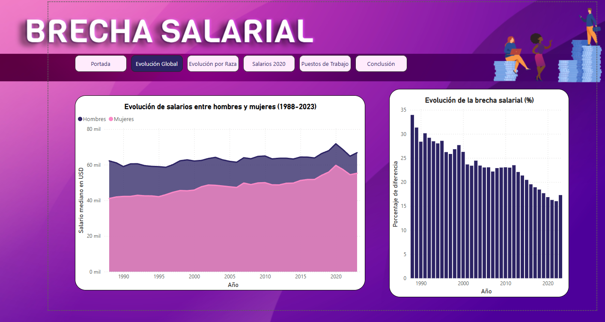
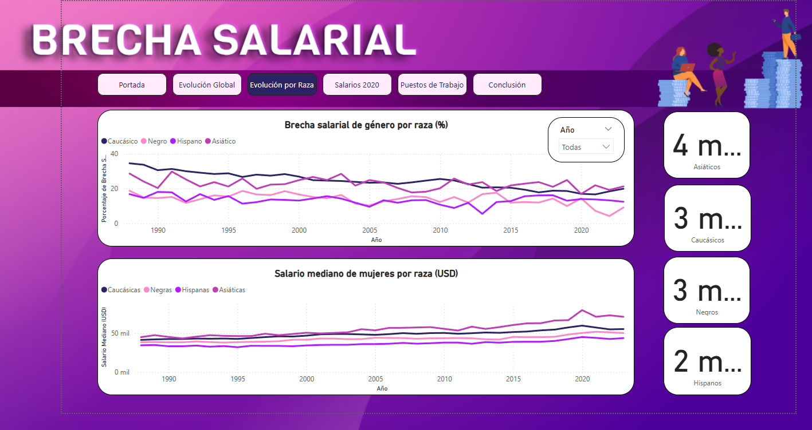
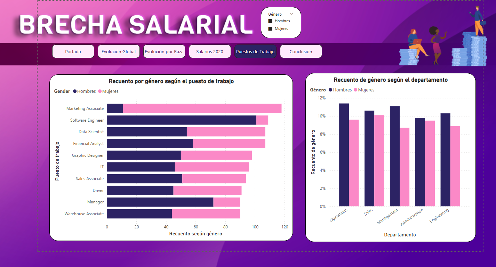

# 🏆 Desvelando la Brecha: Un Viaje a Través de Datos y Desigualdad en EE.UU. (1988-2023) 🇺🇸  

¡Bienvenido a nuestro proyecto!  

Nos hemos sumergido en las profundidades de los datos para iluminar las sombras de la **desigualdad de género y racial** en los Estados Unidos 🇺🇸, desde 1988 hasta 2023.  
Usando **Python** para limpiar y preparar los datos, y **Power BI** para dar vida a las visualizaciones, nuestro objetivo es **hacer visible lo invisible**.  

---

## 📌 Contenido  

📂 **Archivos incluidos**  
- 📁 `files/glassdoorsample.csv` →  Dataset con información detallada sobre salarios del año 2020  
- 📁 `files/race_gender_salaries.csv` → Dataset con la evolución de salarios  
- 📊 `powerbi/proyecto_Mujeres.pbix` → Archivo de Power BI con los reportes  
- 📸 `image/` → Capturas de los dashboards  
- 🌎 https://www.kaggle.com/datasets/nilimajauhari/glassdoor-analyze-gender-pay-gap  → Fuente de nuestros datos
- 🌎 https://www.kaggle.com/datasets/spingere/us-salary-by-race-and-sex  → Fuente de nuestros datos

📜 **Secciones del análisis**  
1. 📈 **Evolución Global**  
2. 🎭 **Brecha Salarial por Raza**  
3. 💰 **Distribución de Salarios en 2020**  
4. 🏢 **Puestos de Trabajo y Salarios**  
5. 📉 **Conclusiones**  

---

## 📊 Ejemplos de Visualizaciones  

### 📈 Evolución Global ⏳  

#### **Brecha Salarial de Género**  
Esta gráfica muestra cómo la **brecha salarial de género** ha evolucionado a lo largo de los años.  
¿Hemos avanzado o seguimos estancados? ⚖️  

  

---

### 🎭 Desigualdad Salarial por Raza y Género  
Exploramos cómo la **intersección de raza y género** amplifica la desigualdad salarial.  
¿Qué historias cuentan estos datos?  

  

---

### 🏢 Distribución de Empleo por Género  
Este gráfico revela la **distribución de empleo por género en diversos sectores**.  
¿Dónde encontramos la mayor disparidad? 👩‍💼👨‍💼  

  

---

## 🏆 Principales Hallazgos  
✅ **La brecha salarial se ha reducido, pero sigue presente en todas las razas.**  
✅ **Las mujeres en tecnología y finanzas enfrentan mayor desigualdad.**  
✅ **Algunos sectores presentan menor disparidad, como logística.**  

---

## ✍ ¿Cómo explorar el reporte?  

1. **Descarga** el archivo `proyecto_Mujeres.pbix`.  

2. **Ábrelo** con Power BI Desktop.  

3. **Explora** las pestañas y gráficos interactivos.  

---

## 🚀 Cómo Usar Este Proyecto  

### 🔧 Requisitos  
🟢 **Power BI Desktop** ([Descargar aquí](https://powerbi.microsoft.com/))  
🟢 **Python 3.x** *(opcional, para procesamiento de datos)*  

### ▶️ Instrucciones  

1. Clona este repositorio:  

   ```bash
   git clone https://github.com/eleonorasoneira/Proyecto_PowerBI.git

Abre proyecto_Mujeres.pbix en Power BI.
📢 Contribuciones
👥 ¡Nos encantaría contar con tu ayuda!
Si encuentras errores, tienes ideas para mejorar el análisis o quieres añadir nuevas visualizaciones,
¡no dudes en abrir un issue o enviar un pull request!

📬 Contacto
Si tienes alguna pregunta o comentario, ¡contáctanos! 📩

👩‍💻 Equipo del Proyecto:

Elena Alique
Katherine Gortz
Eleonora Soneira
✨ ¡Esperamos que este proyecto sea una herramienta útil para comprender y combatir la desigualdad! ✊